# Behavioral_Apparatus_With_Olfactometer

This is the research project I completed when I worked at [Zak Lab](https://www.zak-lab.org/) as an undergraduate student. I made a short video explaining the project and demonstrating the GUI, which you can watch [here](https://www.youtube.com/watch?v=kH7aX3ddSkc)

## Overview

A fully automated, custom-built behavioral apparatus designed to assess olfactory perception in mice. The system combines precise airflow control, an Arduino Mega2560, Raspberry Pi 5, custom hardware, advanced [lick detectors](https://github.com/AllenNeuralDynamics/harp.device.lickety-split), and a Python GUI to reliably generate odor mixtures of up to 16 odors, monitor behavioral responses, deliver rewards, and automatically log experimental data. The apparatus was developed to provide increased experimental rigor and reproducibility when studying subtle differences in olfactory perception.

## Diagram

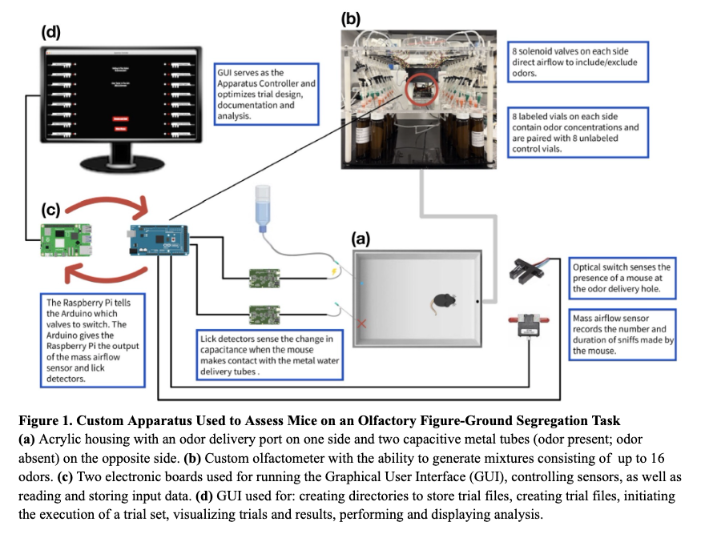

## GUI Screenshots

<table>
  <tr>
    <td align="center">
      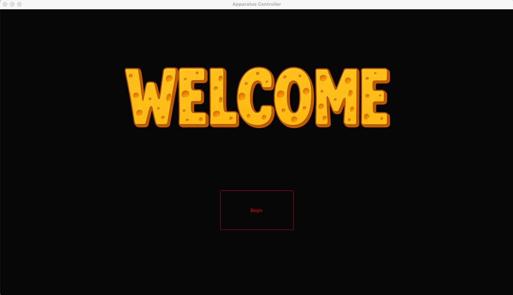 
      <b>Welcome Screen</b>
    </td>
    <td align="center">
      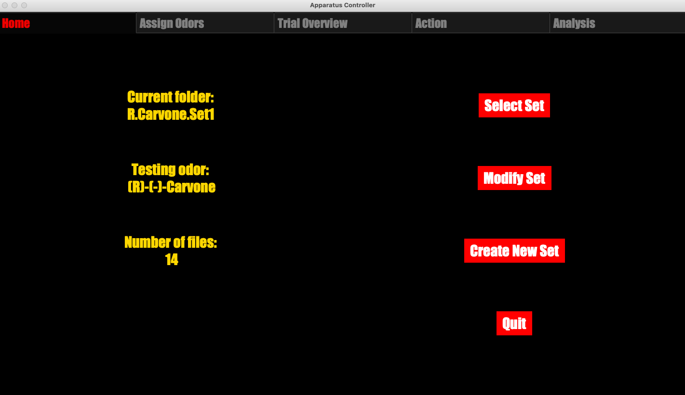 
      <b>Home Screen</b>
    </td>
  </tr>
  <tr>
    <td align="center">
      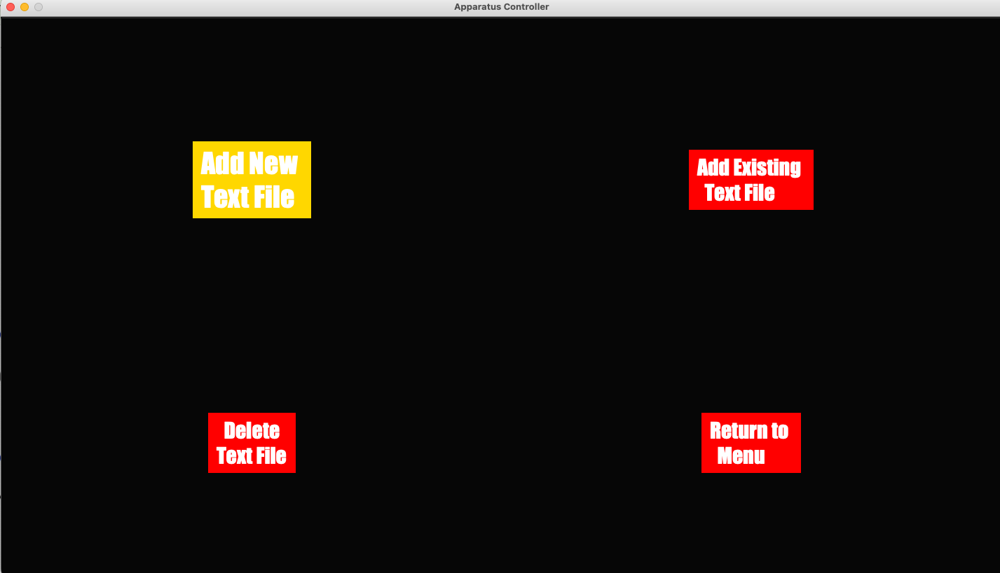 
      <b>Modify Set</b>
    </td>
    <td align="center">
      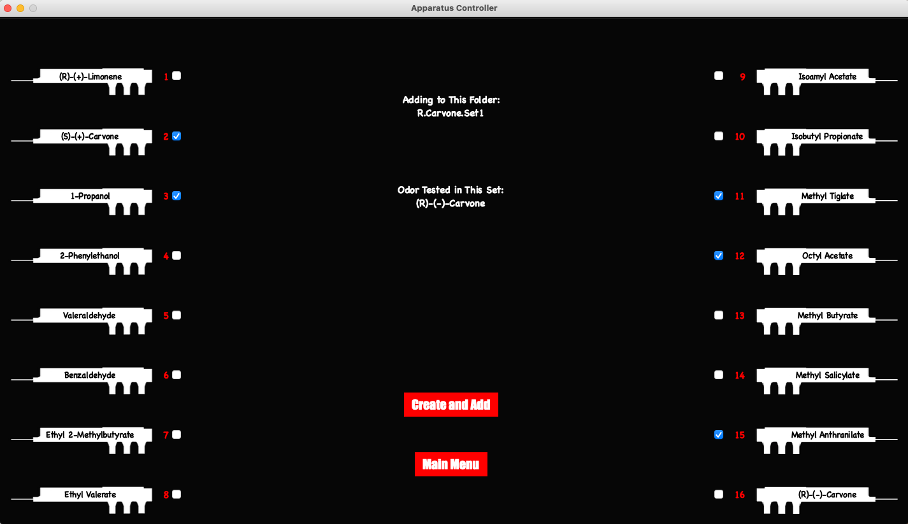 
      <b>Design Trial</b>
    </td>
  </tr>
  <tr>
    <td align="center">
      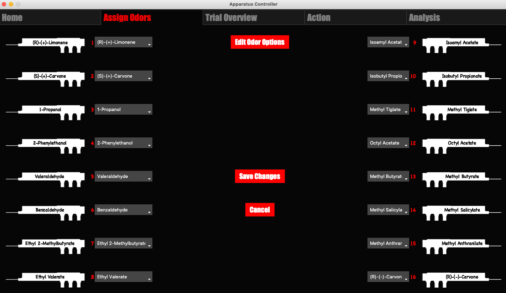 
      <b>Assign Odors</b>
    </td>
    <td align="center">
      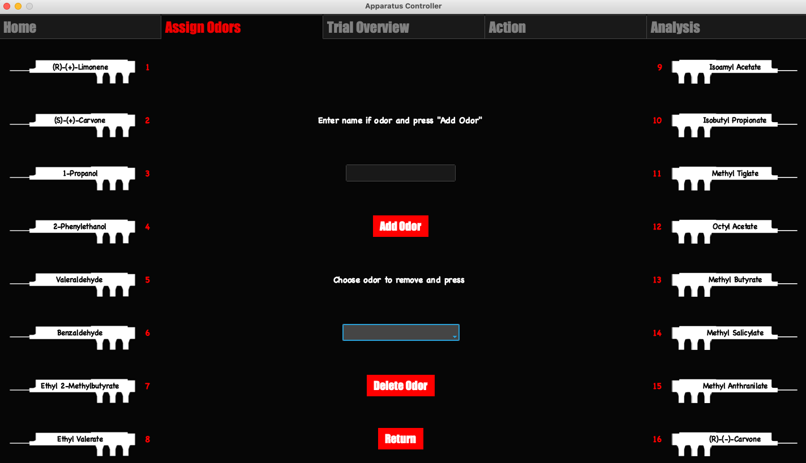 
      <b>Edit Odors</b>
    </td>
  </tr>
  <tr>
    <td align="center">
      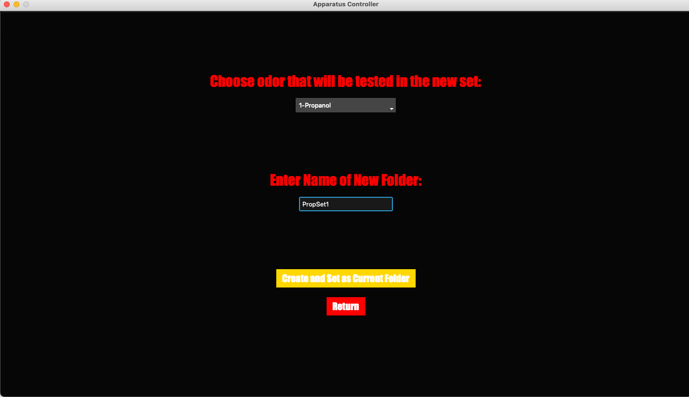 
      <b>Create Trial Set</b>
    </td>
    <td align="center">
      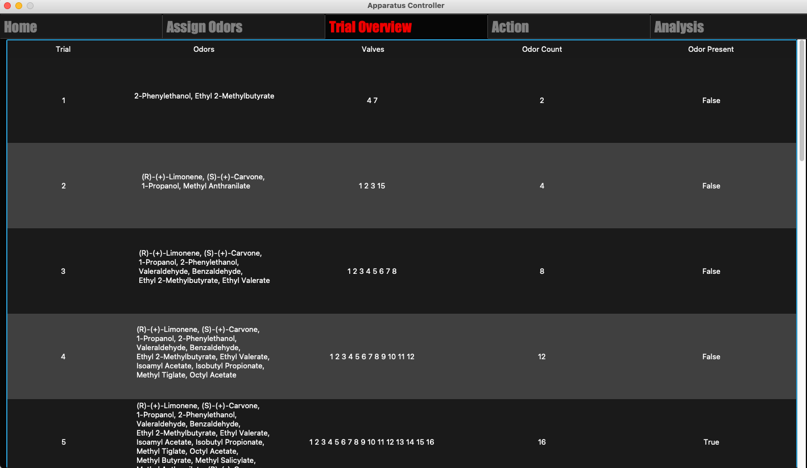 
      <b>Trial Overview</b>
    </td>
  </tr>
  <tr>
    <td align="center">
      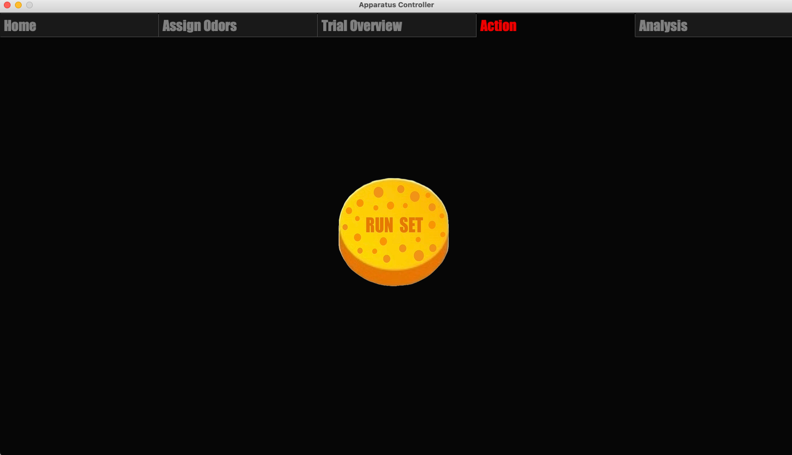 
      <b>Run Trials</b>
    </td>
    <td align="center">
      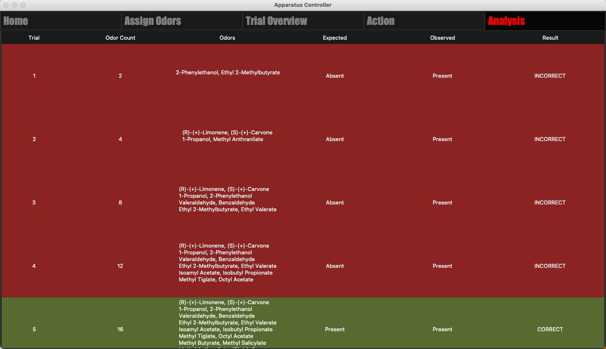 
      <b>Display Results</b>
    </td>
  </tr>
</table>

## Recognition

The development of this apparatus was recognized with the [Founders’ Award in Cellular and Molecular Neuroscience](https://lin.uic.edu/academics/awards/) which is "given to a neuroscience major who has completed an exceptional research project with a focus on cellular/molecular neuroscience and who is a Neuroscience major and has a GPA of 3.2 or higher".
